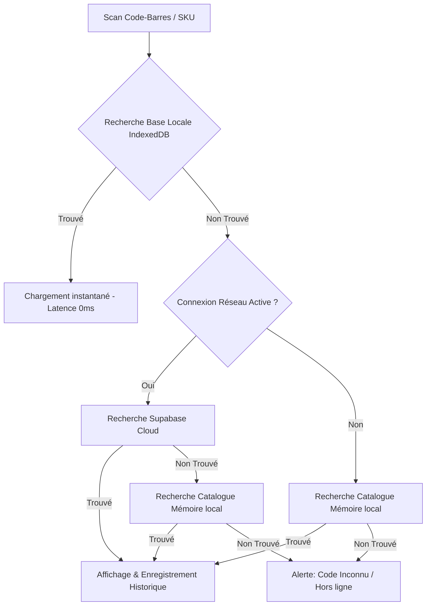

# SCAN_CORE_V.01 - Documentation Complète (A à Z)

Bienvenue dans le document de référence de l'application **SCAN_CORE_V.01**, une interface web progressive (PWA) hautes performances destinée à la numérisation de codes-barres, à l'inventaire et à la gestion d'impression d'étiquettes en milieu industriel ou commercial.

---

## 1. Vision Globale & Concept

**SCAN_CORE_V.01** est conçue pour fonctionner avec une efficacité maximale dans des environnements exigeants (entrepôts, magasins, logistique) où la vitesse de traitement de l'information et la résilience réseau sont critiques. L'application combine :
* Un moteur de scan optique par caméra en temps réel.
* Une interconnexion avec une base de données cloud (Supabase) contenant plus de 15 000 articles.
* Une base locale ultra-rapide (IndexedDB) pour un fonctionnement 100% autonome hors ligne.
* Un système de gestion d'étiquetage à la volée (Tictage) et une station de traitement d'impression avec simulation de ressources physiques.

---

## 2. Design System & Identité Visuelle

L'application arbore une esthétique **Néo-Brutaliste** et **Hyper-Utilitarian** ("Structural Mono"), inspirée des terminaux de commande industriels.

* **Palette de Couleurs** :
  * **Fond & Surfaces** : Stark Grey (`#f9f9f9`) et White (`#ffffff`).
  * **Dividers & Strokes** : Absolute Black (`#000000`) pour toutes les bordures structurelles.
  * **Accent Pulse** : Orange Signalétique (`#D9410E`) utilisé exclusivement pour les boutons d'appel à l'action primaires, les états actifs et les alertes critiques.
* **Typographie** :
  * **Titres & Affichages** : **Hanken Grotesk** (graisses lourdes 700-800, espacement serré) pour un effet graphique d'autorité.
  * **Métadonnées & Technical Data** : **JetBrains Mono** en majuscules pour toutes les étiquettes techniques, codes SKU et horodatages.
* **Bordures & Ombres** :
  * **Sharp Edges** : Rayon d'angle strictement nul (`0px`). Aucun arrondi pour conserver l'aspect brut.
  * **Hard Shadows** : Ombres plates noires sans flou (`box-shadow: 4px 4px 0px 0px #000`) simulant la superposition 3D.
* **Effets CRT & Glitch** : Une incrustation de lignes de balayage CRT animée (`.crt-overlay`) et un effet de glitch au démarrage renforcent l'identité technique de l'interface.

---

## 3. Architecture Technique & Dépendances

L'application repose sur des technologies standardisées et légères pour garantir un temps de chargement minimal :

* **Frontend Core** : HTML5 sémantique, CSS3 pur (Vanilla CSS) avec utilisation de variables personnalisées (`:root`) pour le thème, et Javascript pur (ES6+).
* **Moteur Optique** : Intégration de la bibliothèque **Html5-Qrcode** permettant le scan direct via les caméras des smartphones ou ordinateurs en HTTPS.
* **Base de Données Cloud** : Connexion à **Supabase** via son client JS officiel pour :
  * Interroger en temps réel la table des produits `base_flo` (contenant ~15 322 articles).
  * Consigner l'historique d'impression dans la table `print_queue`.
* **Stockage Hors Ligne (IndexedDB)** : Base de données locale nommée `ScanCoreOfflineDB` (v1) contenant un Object Store `products` indexé sur le code `sku` et la clé primaire `barcode`. Permet des requêtes de décodage instantanées (latence 0ms) même sans réseau.

---

## 4. Description des Fonctionnalités par Module

L'application est structurée en une interface mono-page (SPA) gérée par un routeur Javascript léger contrôlant la visibilité de 8 vues majeures.

### A. Le Scanner Live (`view-live`)
* **Scan Caméra** : Active le flux vidéo du périphérique. Analyse les trames pour décoder les codes-barres 1D et 2D en temps réel.
* **Saisie Manuelle** : Champ de saisie pour saisir manuellement un SKU ou code-barres avec validation par touche Entrée.
* **Démo Quick-Load** : Raccourcis de codes-barres de démonstration pour tester l'application instantanément.
* **Générateur Aléatoire** : Bouton permettant de piocher au hasard un produit dans la base de données distante FLO pour simuler un scan.
* **Télémétrie** : Affiche en direct le framerate du moteur de rendu (compteur de FPS oscillant entre 58 et 60 FPS).

### B. La Fiche Produit Bento (`view-detail`)
* **Grille Bento** : Présente les informations de l'article décodé dans une structure bento hautement lisible :
  * Marque, SKU, Code-barres, Genre, Groupe de produit (ex: *Shoes*), Type (ex: *Accessory*) et Marché de destination.
  * Tarification claire (mise en évidence du prix de solde si applicable).
* **Image Web Dynamique** : Si le produit n'a pas d'image associée, l'application exécute une requête asynchrone sur le Web via plusieurs proxys CORS de secours (AllOrigins, CorsProxy, ThingProxy) pour récupérer et afficher en direct un visuel correspondant (via l'API d'images Bing).
* **Boutons d'Impression rapide** : Raccourcis pour simuler l'impression d'un ticket individuel en mode local (thermique) ou à distance (jet d'encre).
* **Bouton d'édition (Tictage)** : Raccourci direct pour charger le produit scanné dans l'outil de tictage manuel.

### C. Le Journal de Scan / Historique (`view-history`)
* **Statistiques Bento** :
  * **Nombre total de scans** effectués.
  * **Identifiant de la dernière séquence** enregistrée.
  * **Statut de la Base de Données Locale** (IndexedDB).
* **Gestion Offline** :
  * Bouton **Télécharger Base (Hors ligne)** : Télécharge la table `base_flo` (~15 322 lignes) par lots de 1 000 articles depuis Supabase et les stocke dans IndexedDB. La barre de progression brutaliste existante affiche l'avancement en pourcentage en temps réel.
  * Bouton **Poubelle** : Permet de vider intégralement la base IndexedDB locale.
* **Filtres & Recherche** : Barre de recherche textuelle globale et menu déroulant de filtrage par genre (Men, Women, Unisex).
* **Exportation** : Bouton de téléchargement permettant d'exporter l'historique complet des scans au format CSV.

### D. Le Tictage Manuel (`view-tictage-manuel`)
* **Sélection Produit** : Liste déroulante alimentée par le catalogue ou champ de recherche directe par SKU/Code-barres capable de charger instantanément un produit depuis IndexedDB ou Supabase.
* **Ajusteur de Prix** : Affiche le prix d'origine et permet de saisir un nouveau prix de vente.
* **Markdown automatique** : Calcule et affiche en direct le pourcentage de démarque (ex: `-25%`).
* **Paramètres de lot** : Saisie du nombre de copies souhaitées (ex: 15) et choix de l'imprimante cible.
* **Prévisualisation HD 35x35mm** : Rendu graphique en temps réel représentant l'étiquette finale :
  * Département, SKU, code-barres graphique dynamique (lignes verticales générées aléatoirement).
  * Date de validité de la promotion (calculée automatiquement sur une période glissante de 14 jours).
  * Ancien prix barré et nouveau prix de vente formaté.
* **Confirmation** : Le bouton "CONFIRMER & IMPRIMER" ajoute la tâche d'impression dans la file d'attente globale et redirige l'utilisateur vers la Station d'Impression.

### E. La Station d'Impression (`view-print-station`)
Simule le comportement d'un terminal d'impression industriel connecté au réseau (IP: 192.168.1.104).
* **Incoming Queue (File d'attente)** : Liste des tâches d'impression en cours de traitement ou programmées.
  * Les tâches affichent leur identifiant unique, le nom du produit, la quantité d'exemplaires à imprimer, le statut en temps réel (`QUEUED`, `PRINTING...` avec progression animée, `DONE` ou `FAILED`).
* **Consommation d'Encre** : Quatre jauges simulent l'usure physique des cartouches d'encre (Cyan, Magenta, Jaune, Noir) à chaque page imprimée.
  * Si l'un des niveaux d'encre atteint `0%`, l'imprimante passe en état critique d'erreur clignotante `OUT_OF_INK` et suspend l'exécution de la file.
  * **Bouton Ravitailler Encre** : Réinitialise instantanément les cartouches à 100% et relance automatiquement le traitement.
* **Contrôles d'Override** : Boutons **PAUSE** (pour suspendre temporairement le traitement de la file d'attente) et **ARRETER** (pour purger et annuler les travaux restants).
* **System Log** : Terminal rétroéclairé affichant en temps réel les événements du processeur d'impression ( handshake, transmissions de paquets, maintenance, validations réseau). Limité à 50 entrées pour éviter les ralentissements.

### F. Simulateur d'Impression Individuelle (`view-print`)
Un module complémentaire simulant la mise en page d'un ticket de caisse ou d'une étiquette classique (Thermique ou Jet d'encre) avec animation de transmission, barres de briques de chargement, dump hexadécimal et latence fluctuante, se soldant par un écran de succès ou une panne critique (10% de chance d'erreur) menant à un écran de diagnostics réseau.

### G. Kit Marketing (`view-marketing`)
Section présentant les maquettes visuelles de la marque (bannières, en-têtes d'e-mails professionnels) respectant la charte esthétique mono-chrome et orange signalétique.

### H. Configuration (`view-config`)
* Formulaire pour ajouter des produits personnalisés à la volée (SKU, prix, poids, origine, conformité).
* Actions de réinitialisation de l'historique local ou de rechargement des 15 articles types depuis le Cloud.

---

## 5. Résilience & Mode Hors Ligne

Le comportement de l'application s'adapte dynamiquement à l'état du réseau de l'utilisateur :

Grâce à cette logique, les opérateurs peuvent continuer à numériser des produits et générer des étiquettes de promotion au format 35x35mm même dans les zones d'ombre réseau des entrepôts logistiques.
